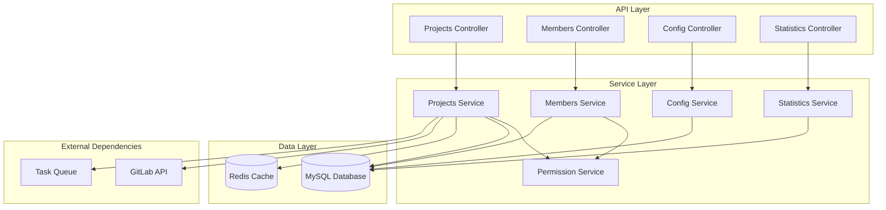

# Design: Project Management API System

## Overview
项目管理 API 系统负责处理 MoonLens 平台中的项目生命周期管理，包括项目 CRUD 操作、成员权限管理、配置管理和数据统计分析。采用分层架构设计，确保系统的可扩展性和维护性。

## System Architecture

### High-Level Architecture


## Component Design

### 1. Controller Layer
```typescript
@Controller('projects')
@ApiTags('Project Management')
@UseGuards(JwtAuthGuard)
export class ProjectsController {
  @Post()
  @RequiredPermissions('project:create')
  @ApiOperation({ summary: '创建项目' })
  createProject(@Body() createDto: CreateProjectDto, @GetUser() user: User): Promise<ProjectResponse>
  
  @Get()
  @ApiOperation({ summary: '获取项目列表' })
  getProjects(@Query() queryDto: ProjectQueryDto, @GetUser() user: User): Promise<ProjectListResponse>
  
  @Get(':id')
  @RequiredPermissions('project:read')
  @ApiOperation({ summary: '获取项目详情' })
  getProject(@Param('id') id: string): Promise<ProjectDetailResponse>
  
  @Put(':id')
  @RequiredPermissions('project:update')
  @ApiOperation({ summary: '更新项目' })
  updateProject(@Param('id') id: string, @Body() updateDto: UpdateProjectDto): Promise<ProjectResponse>
  
  @Delete(':id')
  @RequiredPermissions('project:delete')
  @ApiOperation({ summary: '删除项目' })
  deleteProject(@Param('id') id: string): Promise<MessageResponse>
}

@Controller('projects/:projectId/members')
@ApiTags('Project Members')
@UseGuards(JwtAuthGuard, ProjectAccessGuard)
export class ProjectMembersController {
  @Get()
  @RequiredPermissions('project:members:read')
  getMembers(@Param('projectId') projectId: string): Promise<MemberListResponse>
  
  @Post()
  @RequiredPermissions('project:members:create')
  addMembers(@Param('projectId') projectId: string, @Body() addDto: AddMembersDto): Promise<MemberBatchResponse>
  
  @Put(':memberId')
  @RequiredPermissions('project:members:update')
  updateMemberRole(@Param('projectId') projectId: string, @Param('memberId') memberId: string, @Body() updateDto: UpdateMemberRoleDto): Promise<MemberResponse>
  
  @Delete(':memberId')
  @RequiredPermissions('project:members:delete')
  removeMember(@Param('projectId') projectId: string, @Param('memberId') memberId: string): Promise<MessageResponse>
}
```

### 2. Service Layer
```typescript
@Injectable()
export class ProjectsService {
  constructor(
    @InjectRepository(Project) private projectRepo: Repository<Project>,
    @InjectRepository(ProjectMember) private memberRepo: Repository<ProjectMember>,
    private permissionService: PermissionService,
    private gitlabService: GitlabService,
    private cacheService: CacheService,
    private activityLogger: ActivityLoggerService,
  ) {}
  
  async createProject(createDto: CreateProjectDto, owner: User): Promise<Project> {
    return this.projectRepo.manager.transaction(async (manager) => {
      // 1. 创建项目记录
      const project = manager.create(Project, {
        ...createDto,
        owner,
        isActive: true,
        reviewConfig: this.getDefaultReviewConfig(),
      });
      
      await manager.save(project);
      
      // 2. 添加所有者为项目管理员
      const ownerMember = manager.create(ProjectMember, {
        project,
        user: owner,
        role: ProjectRole.OWNER,
        addedBy: owner,
      });
      
      await manager.save(ownerMember);
      
      // 3. 记录活动日志
      await this.activityLogger.log({
        action: 'project.created',
        projectId: project.id,
        userId: owner.id,
        metadata: { projectName: project.name },
      });
      
      return project;
    });
  }
  
  async getProjectsForUser(user: User, query: ProjectQueryDto): Promise<PaginatedResult<Project>> {
    const queryBuilder = this.projectRepo
      .createQueryBuilder('project')
      .leftJoin('project.members', 'member')
      .leftJoin('member.user', 'user')
      .where('user.id = :userId', { userId: user.id });
    
    if (query.search) {
      queryBuilder.andWhere(
        '(project.name LIKE :search OR project.description LIKE :search)',
        { search: `%${query.search}%` }
      );
    }
    
    if (query.status) {
      queryBuilder.andWhere('project.isActive = :isActive', {
        isActive: query.status === 'active'
      });
    }
    
    const [projects, total] = await queryBuilder
      .orderBy('project.updatedAt', 'DESC')
      .take(query.limit)
      .skip((query.page - 1) * query.limit)
      .getManyAndCount();
    
    return {
      items: projects,
      pagination: {
        page: query.page,
        limit: query.limit,
        total,
        totalPages: Math.ceil(total / query.limit),
      },
    };
  }
}

@Injectable()
export class PermissionService {
  private readonly permissions = new Map<string, Permission>();
  
  constructor() {
    this.initializePermissions();
  }
  
  async checkPermission(user: User, projectId: string, action: string): Promise<boolean> {
    // 1. 获取用户在项目中的角色
    const member = await this.getMemberRole(user.id, projectId);
    if (!member) return false;
    
    // 2. 检查角色权限
    const permission = this.permissions.get(action);
    if (!permission) return false;
    
    return permission.roles.includes(member.role);
  }
  
  private initializePermissions() {
    // 定义权限映射
    this.permissions.set('project:read', {
      roles: [ProjectRole.OWNER, ProjectRole.ADMIN, ProjectRole.MEMBER, ProjectRole.VIEWER],
    });
    
    this.permissions.set('project:update', {
      roles: [ProjectRole.OWNER, ProjectRole.ADMIN],
    });
    
    this.permissions.set('project:delete', {
      roles: [ProjectRole.OWNER],
    });
    
    this.permissions.set('project:members:create', {
      roles: [ProjectRole.OWNER, ProjectRole.ADMIN],
    });
    
    // ... 更多权限定义
  }
}
```

### 3. Data Models
```typescript
@Entity('projects')
export class Project {
  @PrimaryGeneratedColumn('uuid')
  id: string;
  
  @Column()
  name: string;
  
  @Column({ type: 'text', nullable: true })
  description: string;
  
  @Column()
  gitlabProjectId: string;
  
  @Column()
  gitlabProjectUrl: string;
  
  @Column({ nullable: true })
  defaultBranch: string;
  
  @Column({ default: true })
  isActive: boolean;
  
  @Column({ type: 'json', nullable: true })
  reviewConfig: ReviewConfig;
  
  @Column({ nullable: true })
  webhookId: string;
  
  @Column({ nullable: true })
  webhookSecret: string;
  
  // Relations
  @ManyToOne(() => User, { nullable: false })
  owner: User;
  
  @OneToMany(() => ProjectMember, member => member.project)
  members: ProjectMember[];
  
  @OneToMany(() => Review, review => review.project)
  reviews: Review[];
  
  @OneToMany(() => ProjectStatistics, stats => stats.project)
  statistics: ProjectStatistics[];
  
  @CreateDateColumn()
  createdAt: Date;
  
  @UpdateDateColumn()
  updatedAt: Date;
}

@Entity('project_members')
export class ProjectMember {
  @PrimaryGeneratedColumn('uuid')
  id: string;
  
  @ManyToOne(() => Project, project => project.members)
  project: Project;
  
  @ManyToOne(() => User)
  user: User;
  
  @Column({
    type: 'enum',
    enum: ProjectRole,
  })
  role: ProjectRole;
  
  @Column({ type: 'json', nullable: true })
  permissions: string[];
  
  @ManyToOne(() => User)
  addedBy: User;
  
  @CreateDateColumn()
  addedAt: Date;
}

export enum ProjectRole {
  OWNER = 'owner',
  ADMIN = 'admin',
  MEMBER = 'member',
  VIEWER = 'viewer',
}

export interface ReviewConfig {
  enableAutoReview: boolean;
  reviewTriggers: ('merge_request' | 'push' | 'manual')[];
  excludePatterns: string[];
  aiConfig: {
    provider: string;
    model: string;
    maxTokens: number;
    temperature: number;
  };
  notifications: {
    email: boolean;
    webhook?: string;
    slack?: string;
  };
}
```

## API Design

### Request/Response DTOs
```typescript
export class CreateProjectDto {
  @ApiProperty()
  @IsString()
  @MinLength(3)
  @MaxLength(100)
  name: string;
  
  @ApiProperty({ required: false })
  @IsOptional()
  @IsString()
  @MaxLength(500)
  description?: string;
  
  @ApiProperty()
  @IsString()
  gitlabProjectId: string;
  
  @ApiProperty()
  @IsUrl()
  gitlabProjectUrl: string;
  
  @ApiProperty({ required: false })
  @IsOptional()
  @IsString()
  defaultBranch?: string;
}

export class ProjectQueryDto {
  @ApiProperty({ required: false, default: 1 })
  @IsOptional()
  @Type(() => Number)
  @IsInt()
  @Min(1)
  page: number = 1;
  
  @ApiProperty({ required: false, default: 20 })
  @IsOptional()
  @Type(() => Number)
  @IsInt()
  @Min(1)
  @Max(100)
  limit: number = 20;
  
  @ApiProperty({ required: false })
  @IsOptional()
  @IsString()
  search?: string;
  
  @ApiProperty({ required: false, enum: ['active', 'archived'] })
  @IsOptional()
  @IsEnum(['active', 'archived'])
  status?: 'active' | 'archived';
  
  @ApiProperty({ required: false })
  @IsOptional()
  @IsUUID()
  ownerId?: string;
}

export class ProjectResponse {
  @ApiProperty()
  id: string;
  
  @ApiProperty()
  name: string;
  
  @ApiProperty()
  description: string;
  
  @ApiProperty()
  gitlabProjectId: string;
  
  @ApiProperty()
  gitlabProjectUrl: string;
  
  @ApiProperty()
  defaultBranch: string;
  
  @ApiProperty()
  isActive: boolean;
  
  @ApiProperty()
  reviewConfig: ReviewConfig;
  
  @ApiProperty()
  owner: UserSummary;
  
  @ApiProperty()
  memberCount: number;
  
  @ApiProperty()
  createdAt: Date;
  
  @ApiProperty()
  updatedAt: Date;
}
```

## Security and Permissions

### RBAC Implementation
```typescript
// 权限装饰器
export const RequiredPermissions = (...permissions: string[]) => SetMetadata('permissions', permissions);

// 权限守卫
@Injectable()
export class PermissionsGuard implements CanActivate {
  constructor(
    private reflector: Reflector,
    private permissionService: PermissionService,
  ) {}
  
  async canActivate(context: ExecutionContext): Promise<boolean> {
    const requiredPermissions = this.reflector.getAllAndOverride<string[]>('permissions', [
      context.getHandler(),
      context.getClass(),
    ]);
    
    if (!requiredPermissions) {
      return true;
    }
    
    const request = context.switchToHttp().getRequest();
    const user = request.user;
    const projectId = request.params.projectId || request.params.id;
    
    if (!projectId) {
      return false;
    }
    
    for (const permission of requiredPermissions) {
      if (!(await this.permissionService.checkPermission(user, projectId, permission))) {
        return false;
      }
    }
    
    return true;
  }
}

// 项目访问守卫
@Injectable()
export class ProjectAccessGuard implements CanActivate {
  constructor(private projectsService: ProjectsService) {}
  
  async canActivate(context: ExecutionContext): Promise<boolean> {
    const request = context.switchToHttp().getRequest();
    const user = request.user;
    const projectId = request.params.projectId || request.params.id;
    
    if (!projectId) {
      return false;
    }
    
    const hasAccess = await this.projectsService.checkUserAccess(user.id, projectId);
    if (!hasAccess) {
      throw new ForbiddenException('No access to this project');
    }
    
    return true;
  }
}
```

## Statistics and Analytics

### Statistics Service
```typescript
@Injectable()
export class StatisticsService {
  constructor(
    @InjectRepository(ProjectStatistics) private statsRepo: Repository<ProjectStatistics>,
    @InjectRepository(Review) private reviewRepo: Repository<Review>,
    private cacheService: CacheService,
  ) {}
  
  async getProjectStatistics(projectId: string, dateRange: DateRange): Promise<ProjectStatsResponse> {
    const cacheKey = `stats:${projectId}:${dateRange.from}:${dateRange.to}`;
    
    // 尝试从缓存获取
    const cached = await this.cacheService.get<ProjectStatsResponse>(cacheKey);
    if (cached) {
      return cached;
    }
    
    // 计算统计数据
    const stats = await this.calculateProjectStats(projectId, dateRange);
    
    // 缓存结果（15分钟）
    await this.cacheService.set(cacheKey, stats, 900);
    
    return stats;
  }
  
  private async calculateProjectStats(projectId: string, dateRange: DateRange): Promise<ProjectStatsResponse> {
    const [
      totalReviews,
      successfulReviews,
      failedReviews,
      avgQualityScore,
      issuesFound,
      issuesResolved,
    ] = await Promise.all([
      this.reviewRepo.count({
        where: {
          projectId,
          createdAt: Between(dateRange.from, dateRange.to),
        },
      }),
      this.reviewRepo.count({
        where: {
          projectId,
          status: ReviewStatus.COMPLETED,
          createdAt: Between(dateRange.from, dateRange.to),
        },
      }),
      this.reviewRepo.count({
        where: {
          projectId,
          status: ReviewStatus.FAILED,
          createdAt: Between(dateRange.from, dateRange.to),
        },
      }),
      this.reviewRepo
        .createQueryBuilder('review')
        .select('AVG(review.qualityScore)', 'avg')
        .where('review.projectId = :projectId', { projectId })
        .andWhere('review.createdAt BETWEEN :from AND :to', dateRange)
        .getRawOne()
        .then(result => parseFloat(result?.avg || '0')),
      // ... 其他统计查询
    ]);
    
    return {
      overview: {
        totalReviews,
        successfulReviews,
        failedReviews,
        successRate: totalReviews > 0 ? successfulReviews / totalReviews : 0,
        avgQualityScore,
        issuesFound,
        issuesResolved,
      },
      trends: await this.getTrendData(projectId, dateRange),
      memberContributions: await this.getMemberContributions(projectId, dateRange),
    };
  }
}
```

## Caching Strategy

### Cache Implementation
```typescript
@Injectable()
export class ProjectCacheService {
  constructor(@Inject(CACHE_MANAGER) private cacheManager: Cache) {}
  
  // 缓存项目基本信息
  async cacheProject(project: Project, ttl = 1800): Promise<void> {
    await this.cacheManager.set(`project:${project.id}`, project, { ttl });
  }
  
  // 缓存项目成员列表
  async cacheProjectMembers(projectId: string, members: ProjectMember[], ttl = 900): Promise<void> {
    await this.cacheManager.set(`project:${projectId}:members`, members, { ttl });
  }
  
  // 缓存项目配置
  async cacheProjectConfig(projectId: string, config: ReviewConfig, ttl = 3600): Promise<void> {
    await this.cacheManager.set(`project:${projectId}:config`, config, { ttl });
  }
  
  // 缓存用户项目列表
  async cacheUserProjects(userId: string, projects: Project[], ttl = 600): Promise<void> {
    await this.cacheManager.set(`user:${userId}:projects`, projects, { ttl });
  }
  
  // 清除相关缓存
  async invalidateProjectCache(projectId: string): Promise<void> {
    const patterns = [
      `project:${projectId}`,
      `project:${projectId}:*`,
      `stats:${projectId}:*`,
    ];
    
    for (const pattern of patterns) {
      await this.cacheManager.del(pattern);
    }
  }
}
```

## Error Handling

### Custom Exceptions
```typescript
export class ProjectNotFoundException extends NotFoundException {
  constructor(projectId: string) {
    super({
      code: 'PROJECT_001',
      message: 'Project not found',
      details: `Project with ID ${projectId} does not exist or you don't have access`,
    });
  }
}

export class InsufficientPermissionException extends ForbiddenException {
  constructor(action: string) {
    super({
      code: 'PROJECT_002',
      message: 'Insufficient permission',
      details: `You don't have permission to perform action: ${action}`,
    });
  }
}

export class ProjectMemberNotFoundException extends NotFoundException {
  constructor(memberId: string) {
    super({
      code: 'PROJECT_003',
      message: 'Project member not found',
      details: `Member with ID ${memberId} not found in this project`,
    });
  }
}

export class GitlabIntegrationException extends BadRequestException {
  constructor(error: string) {
    super({
      code: 'PROJECT_004',
      message: 'GitLab integration failed',
      details: error,
    });
  }
}
```

## Testing Strategy

### Unit Tests
```typescript
describe('ProjectsService', () => {
  let service: ProjectsService;
  let repository: Repository<Project>;
  let memberRepository: Repository<ProjectMember>;
  
  beforeEach(async () => {
    const module = await Test.createTestingModule({
      providers: [
        ProjectsService,
        {
          provide: getRepositoryToken(Project),
          useClass: Repository,
        },
        {
          provide: getRepositoryToken(ProjectMember),
          useClass: Repository,
        },
        // ... 其他依赖的mock
      ],
    }).compile();
    
    service = module.get<ProjectsService>(ProjectsService);
    repository = module.get<Repository<Project>>(getRepositoryToken(Project));
  });
  
  describe('createProject', () => {
    it('应该成功创建项目', async () => {
      // 测试项目创建逻辑
    });
    
    it('应该在GitLab项目重复时抛出错误', async () => {
      // 测试重复项目处理
    });
  });
  
  describe('getProjectsForUser', () => {
    it('应该返回用户有权限的项目列表', async () => {
      // 测试项目查询和权限过滤
    });
    
    it('应该支持搜索和分页', async () => {
      // 测试搜索和分页功能
    });
  });
});
```

## Performance Optimization

### Database Optimization
```sql
-- 项目表索引
CREATE INDEX idx_projects_owner_id ON projects(owner_id);
CREATE INDEX idx_projects_gitlab_project_id ON projects(gitlab_project_id);
CREATE INDEX idx_projects_is_active ON projects(is_active);
CREATE INDEX idx_projects_updated_at ON projects(updated_at);

-- 项目成员表索引
CREATE INDEX idx_project_members_project_id ON project_members(project_id);
CREATE INDEX idx_project_members_user_id ON project_members(user_id);
CREATE INDEX idx_project_members_role ON project_members(role);

-- 复合索引
CREATE INDEX idx_project_members_project_user ON project_members(project_id, user_id);
```

### Query Optimization
```typescript
// 优化的项目查询，减少N+1问题
async getProjectWithMembers(projectId: string): Promise<Project> {
  return this.projectRepo
    .createQueryBuilder('project')
    .leftJoinAndSelect('project.owner', 'owner')
    .leftJoinAndSelect('project.members', 'members')
    .leftJoinAndSelect('members.user', 'memberUser')
    .where('project.id = :projectId', { projectId })
    .getOne();
}

// 批量预加载用户权限
async preloadUserPermissions(userId: string, projectIds: string[]): Promise<Map<string, ProjectRole>> {
  const members = await this.memberRepo
    .createQueryBuilder('member')
    .select(['member.projectId', 'member.role'])
    .where('member.userId = :userId', { userId })
    .andWhere('member.projectId IN (:...projectIds)', { projectIds })
    .getMany();
  
  return new Map(members.map(member => [member.projectId, member.role]));
}
```

## Module Configuration
```typescript
@Module({
  imports: [
    TypeOrmModule.forFeature([Project, ProjectMember, ProjectStatistics]),
    CacheModule.register(),
    BullModule.registerQueue({
      name: 'project-sync',
    }),
  ],
  controllers: [
    ProjectsController,
    ProjectMembersController,
    ProjectConfigController,
    ProjectStatisticsController,
  ],
  providers: [
    ProjectsService,
    ProjectMembersService,
    ProjectConfigService,
    StatisticsService,
    PermissionService,
    ProjectCacheService,
    ActivityLoggerService,
    {
      provide: APP_GUARD,
      useClass: PermissionsGuard,
    },
  ],
  exports: [
    ProjectsService,
    ProjectMembersService,
    PermissionService,
  ],
})
export class ProjectManagementModule {}
```

这个设计文档涵盖了项目管理API系统的核心架构、数据模型、权限控制、缓存策略和性能优化等关键方面，为后续的具体实现提供了完整的技术指导。