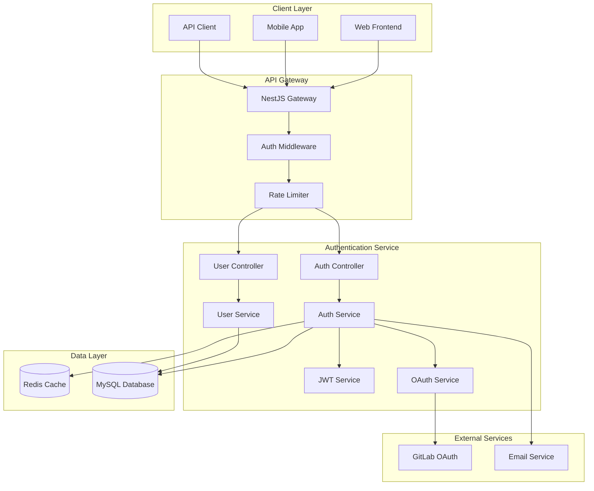
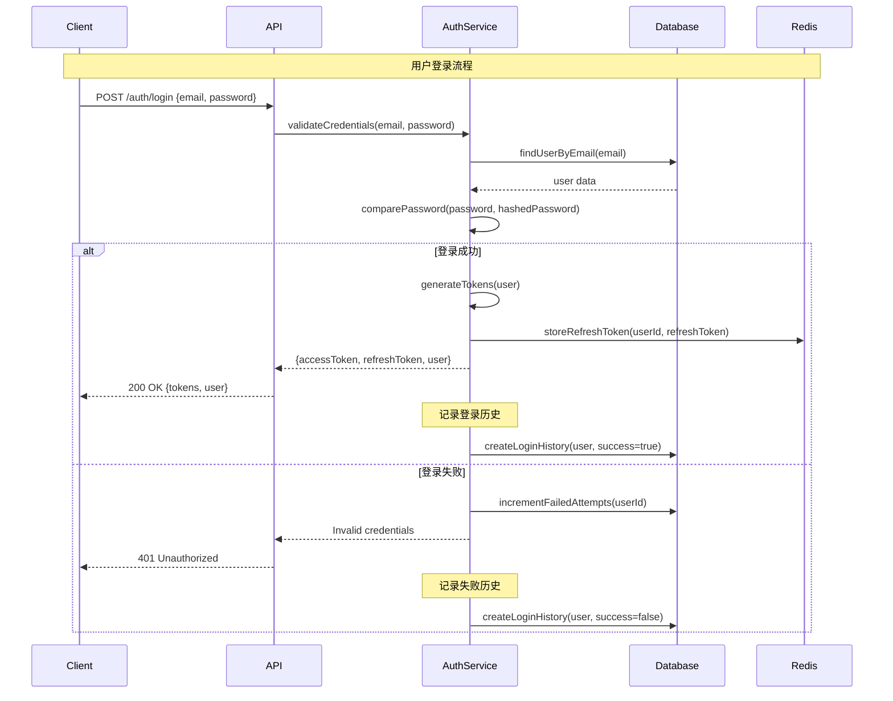

# Design: User Authentication API System

## Overview
用户认证 API 系统设计采用分层架构模式，基于 NestJS 框架构建，提供安全、可扩展的身份验证和授权服务。系统支持多种认证方式，包括传统邮箱密码登录、GitLab OAuth 集成，以及完整的用户生命周期管理。

## System Architecture

### High-Level Architecture


### Component Architecture

#### 1. Controller Layer
```typescript
// Auth Controller - 处理认证相关请求
@Controller('auth')
@ApiTags('Authentication')
export class AuthController {
  @Post('register')
  @ApiOperation({ summary: '用户注册' })
  register(@Body() registerDto: RegisterDto): Promise<AuthResponse>
  
  @Post('login')
  @ApiOperation({ summary: '用户登录' })
  login(@Body() loginDto: LoginDto): Promise<AuthResponse>
  
  @Post('refresh')
  @ApiOperation({ summary: 'Token刷新' })
  refreshToken(@Body() refreshDto: RefreshTokenDto): Promise<TokenResponse>
  
  @Post('logout')
  @UseGuards(JwtAuthGuard)
  @ApiOperation({ summary: '用户登出' })
  logout(@GetUser() user: User): Promise<MessageResponse>
  
  @Get('gitlab/url')
  @ApiOperation({ summary: '获取GitLab OAuth URL' })
  getGitlabAuthUrl(): Promise<OAuthUrlResponse>
  
  @Post('gitlab/callback')
  @ApiOperation({ summary: 'GitLab OAuth回调' })
  gitlabCallback(@Body() callbackDto: OAuthCallbackDto): Promise<AuthResponse>
}

// User Controller - 处理用户管理请求  
@Controller('users')
@ApiTags('User Management')
@UseGuards(JwtAuthGuard)
export class UserController {
  @Get('profile')
  @ApiOperation({ summary: '获取用户资料' })
  getProfile(@GetUser() user: User): Promise<UserProfile>
  
  @Put('profile')
  @ApiOperation({ summary: '更新用户资料' })
  updateProfile(@GetUser() user: User, @Body() updateDto: UpdateProfileDto): Promise<UserProfile>
  
  @Post('change-password')
  @ApiOperation({ summary: '修改密码' })
  changePassword(@GetUser() user: User, @Body() changePasswordDto: ChangePasswordDto): Promise<MessageResponse>
}
```

#### 2. Service Layer
```typescript
// Auth Service - 核心认证业务逻辑
@Injectable()
export class AuthService {
  constructor(
    private userService: UserService,
    private jwtService: JwtService,
    private redisService: RedisService,
    private gitlabOAuthService: GitlabOAuthService,
    private emailService: EmailService,
  ) {}
  
  // 用户注册
  async register(registerDto: RegisterDto): Promise<AuthResponse> {
    // 1. 验证邮箱唯一性
    // 2. 密码强度验证
    // 3. 密码加密存储
    // 4. 创建用户记录
    // 5. 生成 JWT Token
    // 6. 返回认证信息
  }
  
  // 用户登录
  async login(loginDto: LoginDto): Promise<AuthResponse> {
    // 1. 验证用户凭据
    // 2. 检查账户状态
    // 3. 登录失败计数管理
    // 4. 生成 JWT Token
    // 5. 记录登录历史
    // 6. 返回认证信息
  }
  
  // GitLab OAuth登录
  async gitlabLogin(code: string, state: string): Promise<AuthResponse> {
    // 1. 验证 OAuth state
    // 2. 交换 access token
    // 3. 获取 GitLab 用户信息
    // 4. 创建或更新本地用户
    // 5. 生成系统 JWT Token
    // 6. 返回认证信息
  }
}

// JWT Service - Token管理服务
@Injectable()
export class JwtService {
  // 生成访问令牌
  async generateAccessToken(user: User): Promise<string>
  
  // 生成刷新令牌
  async generateRefreshToken(user: User): Promise<string>
  
  // 验证令牌
  async verifyToken(token: string): Promise<JwtPayload>
  
  // 刷新令牌
  async refreshToken(refreshToken: string): Promise<TokenResponse>
  
  // 注销令牌（加入黑名单）
  async revokeToken(token: string): Promise<void>
}
```

#### 3. Data Layer
```typescript
// User Entity - 用户数据模型
@Entity('users')
export class User {
  @PrimaryGeneratedColumn('uuid')
  id: string;
  
  @Column({ unique: true })
  username: string;
  
  @Column({ unique: true })
  email: string;
  
  @Column()
  password: string;
  
  @Column({ nullable: true })
  fullName: string;
  
  @Column({ nullable: true })
  avatar: string;
  
  @Column({ default: true })
  isActive: boolean;
  
  @Column({ nullable: true })
  gitlabUserId: string;
  
  @Column({ type: 'text', nullable: true })
  gitlabAccessToken: string;
  
  @Column({ type: 'json', nullable: true })
  preferences: Record<string, any>;
  
  @Column({ default: 0 })
  failedLoginAttempts: number;
  
  @Column({ nullable: true })
  lockedUntil: Date;
  
  @Column({ nullable: true })
  emailVerifiedAt: Date;
  
  @CreateDateColumn()
  createdAt: Date;
  
  @UpdateDateColumn()
  updatedAt: Date;
  
  // Relations
  @OneToMany(() => Project, project => project.owner)
  projects: Project[];
  
  @OneToMany(() => Review, review => review.requestedBy)
  reviews: Review[];
  
  @OneToMany(() => LoginHistory, history => history.user)
  loginHistory: LoginHistory[];
}

// Token Blacklist Entity - Token黑名单
@Entity('token_blacklist')
export class TokenBlacklist {
  @PrimaryGeneratedColumn('uuid')
  id: string;
  
  @Column()
  tokenHash: string;
  
  @ManyToOne(() => User)
  user: User;
  
  @Column()
  expiresAt: Date;
  
  @CreateDateColumn()
  createdAt: Date;
}

// Login History Entity - 登录历史
@Entity('login_history')
export class LoginHistory {
  @PrimaryGeneratedColumn('uuid')
  id: string;
  
  @ManyToOne(() => User, user => user.loginHistory)
  user: User;
  
  @Column({ nullable: true })
  ipAddress: string;
  
  @Column({ type: 'text', nullable: true })
  userAgent: string;
  
  @Column()
  loginMethod: 'email' | 'gitlab';
  
  @Column()
  success: boolean;
  
  @Column({ nullable: true })
  failureReason: string;
  
  @CreateDateColumn()
  createdAt: Date;
}
```

## Security Design

### Authentication Flow


### JWT Token Structure
```typescript
// Access Token Payload
interface AccessTokenPayload {
  sub: string;           // 用户ID
  email: string;         // 用户邮箱
  username: string;      // 用户名
  roles: string[];       // 用户角色
  iat: number;          // 签发时间
  exp: number;          // 过期时间
}

// Refresh Token Payload
interface RefreshTokenPayload {
  sub: string;           // 用户ID
  tokenId: string;       // Token唯一标识
  iat: number;          // 签发时间
  exp: number;          // 过期时间
}
```

### Password Security
```typescript
// 密码加密策略
@Injectable()
export class PasswordService {
  private readonly saltRounds = 10;
  
  async hashPassword(password: string): Promise<string> {
    return bcrypt.hash(password, this.saltRounds);
  }
  
  async comparePassword(password: string, hashedPassword: string): Promise<boolean> {
    return bcrypt.compare(password, hashedPassword);
  }
  
  validatePasswordStrength(password: string): PasswordValidation {
    const requirements = {
      minLength: 8,
      requireUppercase: true,
      requireLowercase: true,
      requireNumbers: true,
      requireSpecialChars: false,
    };
    
    return {
      isValid: this.checkAllRequirements(password, requirements),
      requirements,
      strength: this.calculateStrength(password),
    };
  }
}
```

### OAuth Integration
```typescript
// GitLab OAuth Service
@Injectable()
export class GitlabOAuthService {
  constructor(private httpService: HttpService) {}
  
  // 生成授权URL
  generateAuthUrl(state: string): string {
    const params = new URLSearchParams({
      client_id: this.configService.get('GITLAB_CLIENT_ID'),
      redirect_uri: this.configService.get('GITLAB_REDIRECT_URI'),
      response_type: 'code',
      scope: 'read_user read_api',
      state,
    });
    
    return `https://gitlab.com/oauth/authorize?${params.toString()}`;
  }
  
  // 交换访问令牌
  async exchangeCodeForToken(code: string): Promise<OAuthTokenResponse> {
    const response = await this.httpService.post('https://gitlab.com/oauth/token', {
      client_id: this.configService.get('GITLAB_CLIENT_ID'),
      client_secret: this.configService.get('GITLAB_CLIENT_SECRET'),
      code,
      grant_type: 'authorization_code',
      redirect_uri: this.configService.get('GITLAB_REDIRECT_URI'),
    }).toPromise();
    
    return response.data;
  }
  
  // 获取用户信息
  async getUserInfo(accessToken: string): Promise<GitlabUser> {
    const response = await this.httpService.get('https://gitlab.com/api/v4/user', {
      headers: { Authorization: `Bearer ${accessToken}` },
    }).toPromise();
    
    return response.data;
  }
}
```

## API Design

### Request/Response DTOs
```typescript
// 注册请求DTO
export class RegisterDto {
  @ApiProperty({ example: 'user@example.com' })
  @IsEmail()
  email: string;
  
  @ApiProperty({ example: 'SecureP@ss123' })
  @IsStrongPassword()
  @MinLength(8)
  password: string;
  
  @ApiProperty({ example: 'johndoe' })
  @IsString()
  @MinLength(3)
  @MaxLength(50)
  username: string;
  
  @ApiProperty({ example: 'John Doe', required: false })
  @IsOptional()
  @IsString()
  fullName?: string;
}

// 登录请求DTO
export class LoginDto {
  @ApiProperty({ example: 'user@example.com' })
  @IsEmail()
  email: string;
  
  @ApiProperty({ example: 'SecureP@ss123' })
  @IsString()
  password: string;
  
  @ApiProperty({ example: false, required: false })
  @IsOptional()
  @IsBoolean()
  rememberMe?: boolean;
}

// 认证响应DTO
export class AuthResponse {
  @ApiProperty()
  user: UserProfile;
  
  @ApiProperty()
  tokens: TokenResponse;
  
  @ApiProperty()
  expiresIn: number;
}

export class TokenResponse {
  @ApiProperty()
  accessToken: string;
  
  @ApiProperty()
  refreshToken: string;
  
  @ApiProperty()
  tokenType: string = 'Bearer';
}

export class UserProfile {
  @ApiProperty()
  id: string;
  
  @ApiProperty()
  username: string;
  
  @ApiProperty()
  email: string;
  
  @ApiProperty()
  fullName: string;
  
  @ApiProperty()
  avatar: string;
  
  @ApiProperty()
  isActive: boolean;
  
  @ApiProperty()
  gitlabUserId?: string;
  
  @ApiProperty()
  createdAt: Date;
  
  @ApiProperty()
  lastLoginAt?: Date;
}
```

### API Endpoints Documentation

#### Authentication Endpoints
```typescript
/**
 * POST /api/auth/register
 * 用户注册
 */
@Post('register')
@ApiOperation({
  summary: '用户注册',
  description: '使用邮箱和密码创建新用户账号',
})
@ApiResponse({
  status: 201,
  description: '注册成功',
  type: AuthResponse,
})
@ApiResponse({
  status: 400,
  description: '请求参数错误或邮箱已存在',
})
@ApiResponse({
  status: 429,
  description: '请求频率超限',
})
register(@Body() registerDto: RegisterDto): Promise<AuthResponse>

/**
 * POST /api/auth/login
 * 用户登录
 */
@Post('login')
@ApiOperation({
  summary: '用户登录',
  description: '使用邮箱和密码进行身份验证',
})
@ApiResponse({
  status: 200,
  description: '登录成功',
  type: AuthResponse,
})
@ApiResponse({
  status: 401,
  description: '凭据无效或账户被锁定',
})
@ApiResponse({
  status: 429,
  description: '登录尝试过于频繁',
})
login(@Body() loginDto: LoginDto): Promise<AuthResponse>
```

## Error Handling Design

### Error Response Structure
```typescript
// 标准错误响应
export class ErrorResponse {
  @ApiProperty()
  error: {
    code: string;
    message: string;
    details?: string;
    timestamp: string;
    path: string;
    traceId?: string;
  };
}

// 验证错误响应
export class ValidationErrorResponse extends ErrorResponse {
  @ApiProperty()
  error: {
    code: 'VALIDATION_ERROR';
    message: string;
    details: string;
    fields: {
      [key: string]: string[];
    };
    timestamp: string;
    path: string;
  };
}
```

### Error Codes
```typescript
export enum AuthErrorCodes {
  // 认证错误
  INVALID_CREDENTIALS = 'AUTH_001',
  ACCOUNT_LOCKED = 'AUTH_002',
  TOKEN_EXPIRED = 'AUTH_003',
  TOKEN_INVALID = 'AUTH_004',
  
  // 注册错误
  EMAIL_EXISTS = 'AUTH_005',
  WEAK_PASSWORD = 'AUTH_006',
  INVALID_USERNAME = 'AUTH_007',
  
  // OAuth错误
  OAUTH_AUTHORIZATION_FAILED = 'OAUTH_001',
  OAUTH_TOKEN_INVALID = 'OAUTH_002',
  OAUTH_USER_INFO_FAILED = 'OAUTH_003',
  
  // 系统错误
  INTERNAL_ERROR = 'SYS_001',
  RATE_LIMIT_EXCEEDED = 'SYS_002',
  SERVICE_UNAVAILABLE = 'SYS_003',
}
```

### Global Exception Filter
```typescript
@Catch()
export class GlobalExceptionFilter implements ExceptionFilter {
  catch(exception: unknown, host: ArgumentsHost) {
    const ctx = host.switchToHttp();
    const response = ctx.getResponse<Response>();
    const request = ctx.getRequest<Request>();
    
    let status: number;
    let errorCode: string;
    let message: string;
    let details: string;
    
    if (exception instanceof HttpException) {
      status = exception.getStatus();
      const errorResponse = exception.getResponse();
      
      if (typeof errorResponse === 'object' && errorResponse !== null) {
        errorCode = (errorResponse as any).code || 'HTTP_ERROR';
        message = (errorResponse as any).message || exception.message;
        details = (errorResponse as any).details;
      } else {
        errorCode = 'HTTP_ERROR';
        message = errorResponse as string;
      }
    } else {
      status = 500;
      errorCode = 'INTERNAL_ERROR';
      message = 'Internal server error';
      details = process.env.NODE_ENV === 'development' ? (exception as Error).stack : undefined;
    }
    
    const errorResponse = {
      error: {
        code: errorCode,
        message,
        details,
        timestamp: new Date().toISOString(),
        path: request.url,
        traceId: request.headers['x-trace-id'],
      },
    };
    
    response.status(status).json(errorResponse);
  }
}
```

## Validation and Guards

### Authentication Guards
```typescript
// JWT认证守卫
@Injectable()
export class JwtAuthGuard extends AuthGuard('jwt') {
  canActivate(context: ExecutionContext) {
    return super.canActivate(context);
  }
  
  handleRequest(err: any, user: any, info: any) {
    if (err || !user) {
      throw err || new UnauthorizedException('Invalid token');
    }
    return user;
  }
}

// 角色权限守卫
@Injectable()
export class RolesGuard implements CanActivate {
  constructor(private reflector: Reflector) {}
  
  canActivate(context: ExecutionContext): boolean {
    const requiredRoles = this.reflector.getAllAndOverride<Role[]>('roles', [
      context.getHandler(),
      context.getClass(),
    ]);
    
    if (!requiredRoles) {
      return true;
    }
    
    const { user } = context.switchToHttp().getRequest();
    return requiredRoles.some((role) => user.roles?.includes(role));
  }
}

// 频率限制守卫
@Injectable()
export class ThrottlerGuard extends ThrottlerGuard {
  protected async getTracker(req: Record<string, any>): Promise<string> {
    return req.ips.length ? req.ips[0] : req.ip; // 使用IP作为跟踪标识
  }
}
```

### Validation Pipes
```typescript
// 自定义验证管道
@Injectable()
export class ValidationPipe implements PipeTransform<any> {
  async transform(value: any, { metatype }: ArgumentMetadata) {
    if (!metatype || !this.toValidate(metatype)) {
      return value;
    }
    
    const object = plainToClass(metatype, value);
    const errors = await validate(object);
    
    if (errors.length > 0) {
      const messages = this.buildErrorMessages(errors);
      throw new BadRequestException({
        code: 'VALIDATION_ERROR',
        message: 'Validation failed',
        fields: messages,
      });
    }
    
    return object;
  }
  
  private toValidate(metatype: Function): boolean {
    const types: Function[] = [String, Boolean, Number, Array, Object];
    return !types.includes(metatype);
  }
  
  private buildErrorMessages(errors: ValidationError[]): Record<string, string[]> {
    const messages: Record<string, string[]> = {};
    
    errors.forEach((error) => {
      messages[error.property] = Object.values(error.constraints || {});
    });
    
    return messages;
  }
}
```

## Testing Strategy

### Unit Tests
```typescript
describe('AuthService', () => {
  let service: AuthService;
  let userService: UserService;
  let jwtService: JwtService;
  let redisService: RedisService;
  
  beforeEach(async () => {
    const module: TestingModule = await Test.createTestingModule({
      providers: [
        AuthService,
        {
          provide: UserService,
          useValue: mockUserService,
        },
        {
          provide: JwtService,
          useValue: mockJwtService,
        },
        {
          provide: RedisService,
          useValue: mockRedisService,
        },
      ],
    }).compile();
    
    service = module.get<AuthService>(AuthService);
  });
  
  describe('register', () => {
    it('应该成功注册新用户', async () => {
      // 测试用户注册逻辑
    });
    
    it('应该在邮箱已存在时抛出错误', async () => {
      // 测试邮箱唯一性验证
    });
    
    it('应该在密码不符合要求时抛出错误', async () => {
      // 测试密码强度验证
    });
  });
  
  describe('login', () => {
    it('应该使用有效凭据成功登录', async () => {
      // 测试正常登录流程
    });
    
    it('应该在无效凭据时抛出错误', async () => {
      // 测试登录失败处理
    });
    
    it('应该在账户锁定时抛出错误', async () => {
      // 测试账户锁定机制
    });
  });
});
```

### Integration Tests
```typescript
describe('AuthController (e2e)', () => {
  let app: INestApplication;
  
  beforeEach(async () => {
    const moduleFixture: TestingModule = await Test.createTestingModule({
      imports: [AppModule],
    }).compile();
    
    app = moduleFixture.createNestApplication();
    await app.init();
  });
  
  it('/auth/register (POST)', () => {
    return request(app.getHttpServer())
      .post('/auth/register')
      .send({
        email: 'test@example.com',
        password: 'SecureP@ss123',
        username: 'testuser',
      })
      .expect(201)
      .expect((res) => {
        expect(res.body.user).toBeDefined();
        expect(res.body.tokens).toBeDefined();
        expect(res.body.tokens.accessToken).toBeDefined();
        expect(res.body.tokens.refreshToken).toBeDefined();
      });
  });
  
  it('/auth/login (POST)', () => {
    return request(app.getHttpServer())
      .post('/auth/login')
      .send({
        email: 'test@example.com',
        password: 'SecureP@ss123',
      })
      .expect(200)
      .expect((res) => {
        expect(res.body.user).toBeDefined();
        expect(res.body.tokens).toBeDefined();
      });
  });
});
```

## Performance Considerations

### Caching Strategy
```typescript
// Redis缓存配置
@Injectable()
export class CacheService {
  constructor(@Inject(CACHE_MANAGER) private cacheManager: Cache) {}
  
  // 缓存用户信息（短期）
  async cacheUser(userId: string, user: User, ttl = 300): Promise<void> {
    await this.cacheManager.set(`user:${userId}`, user, { ttl });
  }
  
  // 缓存刷新令牌（长期）
  async cacheRefreshToken(userId: string, token: string, ttl = 2592000): Promise<void> {
    await this.cacheManager.set(`refresh:${userId}`, token, { ttl });
  }
  
  // 缓存登录失败次数
  async cacheFailedAttempts(email: string, attempts: number, ttl = 900): Promise<void> {
    await this.cacheManager.set(`failed:${email}`, attempts, { ttl });
  }
}
```

### Database Optimization
```sql
-- 用户表索引优化
CREATE INDEX idx_users_email ON users(email);
CREATE INDEX idx_users_username ON users(username);
CREATE INDEX idx_users_gitlab_user_id ON users(gitlab_user_id);
CREATE INDEX idx_users_is_active ON users(is_active);

-- 登录历史表索引优化
CREATE INDEX idx_login_history_user_id ON login_history(user_id);
CREATE INDEX idx_login_history_created_at ON login_history(created_at);
CREATE INDEX idx_login_history_success ON login_history(success);

-- Token黑名单表索引优化
CREATE INDEX idx_token_blacklist_token_hash ON token_blacklist(token_hash);
CREATE INDEX idx_token_blacklist_expires_at ON token_blacklist(expires_at);
```

## Deployment Configuration

### Environment Configuration
```typescript
// 配置验证Schema
export const configValidationSchema = Joi.object({
  // 数据库配置
  DATABASE_URL: Joi.string().required(),
  DATABASE_SSL: Joi.boolean().default(false),
  
  // Redis配置
  REDIS_HOST: Joi.string().default('localhost'),
  REDIS_PORT: Joi.number().default(6379),
  REDIS_PASSWORD: Joi.string().optional(),
  
  // JWT配置
  JWT_SECRET: Joi.string().required().min(32),
  JWT_EXPIRES_IN: Joi.string().default('15m'),
  JWT_REFRESH_EXPIRES_IN: Joi.string().default('30d'),
  
  // GitLab OAuth配置
  GITLAB_CLIENT_ID: Joi.string().required(),
  GITLAB_CLIENT_SECRET: Joi.string().required(),
  GITLAB_REDIRECT_URI: Joi.string().uri().required(),
  
  // 邮件服务配置
  SMTP_HOST: Joi.string().required(),
  SMTP_PORT: Joi.number().default(587),
  SMTP_USER: Joi.string().required(),
  SMTP_PASS: Joi.string().required(),
  
  // 安全配置
  RATE_LIMIT_TTL: Joi.number().default(60),
  RATE_LIMIT_MAX: Joi.number().default(100),
  BCRYPT_ROUNDS: Joi.number().default(10),
  
  // 应用配置
  NODE_ENV: Joi.string().valid('development', 'production', 'test').default('development'),
  PORT: Joi.number().default(3000),
  API_PREFIX: Joi.string().default('api'),
});
```

### Module Configuration
```typescript
@Module({
  imports: [
    // 配置模块
    ConfigModule.forRoot({
      isGlobal: true,
      validationSchema: configValidationSchema,
    }),
    
    // 数据库模块
    TypeOrmModule.forRootAsync({
      imports: [ConfigModule],
      useFactory: (configService: ConfigService) => ({
        type: 'mysql',
        url: configService.get('DATABASE_URL'),
        ssl: configService.get('DATABASE_SSL'),
        entities: [User, TokenBlacklist, LoginHistory],
        synchronize: configService.get('NODE_ENV') !== 'production',
        logging: configService.get('NODE_ENV') === 'development',
      }),
      inject: [ConfigService],
    }),
    
    // Redis缓存模块
    CacheModule.registerAsync({
      imports: [ConfigModule],
      useFactory: (configService: ConfigService) => ({
        store: redisStore,
        host: configService.get('REDIS_HOST'),
        port: configService.get('REDIS_PORT'),
        password: configService.get('REDIS_PASSWORD'),
        ttl: 300, // 默认缓存5分钟
      }),
      inject: [ConfigService],
    }),
    
    // JWT模块
    JwtModule.registerAsync({
      imports: [ConfigModule],
      useFactory: (configService: ConfigService) => ({
        secret: configService.get('JWT_SECRET'),
        signOptions: {
          expiresIn: configService.get('JWT_EXPIRES_IN'),
        },
      }),
      inject: [ConfigService],
    }),
    
    // 频率限制模块
    ThrottlerModule.forRootAsync({
      imports: [ConfigModule],
      useFactory: (configService: ConfigService) => ({
        ttl: configService.get('RATE_LIMIT_TTL'),
        limit: configService.get('RATE_LIMIT_MAX'),
      }),
      inject: [ConfigService],
    }),
  ],
  controllers: [AuthController, UserController],
  providers: [
    AuthService,
    UserService,
    JwtService,
    GitlabOAuthService,
    PasswordService,
    CacheService,
    // 全局守卫
    {
      provide: APP_GUARD,
      useClass: ThrottlerGuard,
    },
    // 全局异常过滤器
    {
      provide: APP_FILTER,
      useClass: GlobalExceptionFilter,
    },
    // 全局验证管道
    {
      provide: APP_PIPE,
      useClass: ValidationPipe,
    },
  ],
  exports: [AuthService, UserService, JwtService],
})
export class AuthModule {}
```

## Documentation and API Specs

### OpenAPI Configuration
```typescript
// Swagger配置
export function setupSwagger(app: INestApplication) {
  const config = new DocumentBuilder()
    .setTitle('MoonLens Authentication API')
    .setDescription('用户认证和授权API文档')
    .setVersion('1.0')
    .addBearerAuth(
      {
        type: 'http',
        scheme: 'bearer',
        bearerFormat: 'JWT',
        name: 'JWT',
        description: 'Enter JWT token',
        in: 'header',
      },
      'JWT-auth',
    )
    .addServer('http://localhost:3000', 'Development server')
    .addServer('https://api.moonlens.dev', 'Production server')
    .build();
    
  const document = SwaggerModule.createDocument(app, config);
  SwaggerModule.setup('api/docs', app, document, {
    swaggerOptions: {
      persistAuthorization: true,
    },
  });
}
```

## Next Steps

设计文档完成后，下一步将创建详细的实施任务清单，包括：

1. **环境搭建任务**: 数据库迁移、Redis配置、环境变量设置
2. **核心服务开发**: 认证服务、用户服务、JWT服务实现
3. **API控制器开发**: 路由定义、请求验证、响应格式化
4. **安全机制实现**: 认证守卫、权限控制、频率限制
5. **OAuth集成开发**: GitLab集成、回调处理、用户信息同步
6. **测试用例编写**: 单元测试、集成测试、端到端测试
7. **文档完善**: API文档、部署指南、维护手册

这个设计提供了完整的用户认证API系统架构蓝图，确保系统的安全性、可扩展性和维护性。