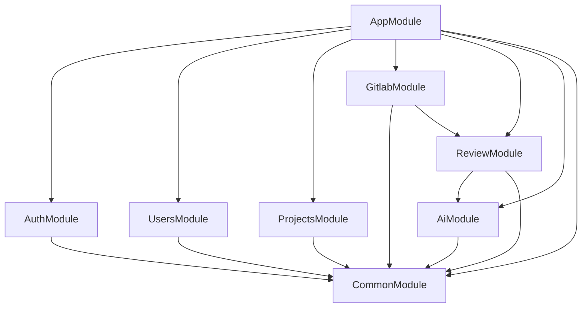

# Codebase Structure - MoonLens GitLab AI 代码审查平台

## 项目概览

MoonLens 采用典型的 NestJS 企业级应用架构，遵循模块化、分层设计原则。项目结构清晰，便于维护和扩展。

## 目录结构

```
MoonLens-server/
├── src/                    # 源代码目录
│   ├── main.ts            # 应用入口点
│   ├── app.module.ts      # 根模块
│   ├── app.controller.ts  # 根控制器
│   ├── app.service.ts     # 根服务
│   │
│   ├── auth/              # 认证授权模块
│   │   ├── auth.module.ts
│   │   ├── auth.controller.ts
│   │   ├── auth.service.ts
│   │   ├── auth.*.spec.ts
│   │   └── dto/
│   │       └── auth.dto.ts
│   │
│   ├── users/             # 用户管理模块
│   │   ├── users.module.ts
│   │   ├── users.controller.ts
│   │   ├── users.service.ts
│   │   └── users.*.spec.ts
│   │
│   ├── projects/          # 项目管理模块
│   │   ├── projects.module.ts
│   │   ├── projects.controller.ts
│   │   ├── projects.service.ts
│   │   └── projects.*.spec.ts
│   │
│   ├── gitlab/            # GitLab 集成模块
│   │   ├── gitlab.module.ts
│   │   ├── gitlab.controller.ts
│   │   ├── gitlab.service.ts
│   │   └── gitlab.*.spec.ts
│   │
│   ├── review/            # 代码审查核心模块
│   │   ├── review.module.ts
│   │   ├── review.controller.ts
│   │   ├── review.service.ts
│   │   └── review.*.spec.ts
│   │
│   ├── ai/                # AI 服务模块
│   │   ├── ai.module.ts
│   │   ├── ai.controller.ts
│   │   ├── ai.service.ts
│   │   └── ai.*.spec.ts
│   │
│   └── common/            # 共享模块
│       ├── common.module.ts
│       └── services/
│           └── prisma.service.ts
│
├── prisma/                # 数据库相关
│   └── schema.prisma     # 数据模型定义
│
├── test/                  # 端到端测试
│   ├── app.e2e-spec.ts
│   └── jest-e2e.json
│
├── .spec-workflow/        # 规范工作流
│   └── steering/          # 指导文档
│       ├── product.md
│       ├── tech.md
│       └── structure.md
│
├── .serena/              # Serena 代理配置
│   ├── project.yml
│   └── memories/
│
├── config files          # 配置文件
│   ├── package.json
│   ├── tsconfig.json
│   ├── nest-cli.json
│   ├── eslint.config.mjs
│   ├── .prettierrc
│   ├── docker-compose.yml
│   ├── Dockerfile
│   └── .env.example
│
└── documentation         # 项目文档
    ├── README.md
    ├── Architecture-Overview.md
    ├── AGENTS.md
    └── SPEC-GUIDE.md
```

## 架构分层

### 1. 表现层（Presentation Layer）
**位置**: `src/**/*.controller.ts`
**职责**:
- HTTP 请求/响应处理
- 路由定义和参数验证
- API 文档生成（Swagger）
- 认证授权拦截

**关键文件**:
- `src/app.controller.ts` - 根控制器
- `src/auth/auth.controller.ts` - 认证控制器
- `src/gitlab/gitlab.controller.ts` - GitLab Webhook 接收
- `src/review/review.controller.ts` - 审查任务管理
- `src/ai/ai.controller.ts` - AI 服务控制

### 2. 业务逻辑层（Business Logic Layer）
**位置**: `src/**/*.service.ts`
**职责**:
- 核心业务逻辑实现
- 服务间协调和编排
- 业务规则验证
- 事件处理和状态管理

**关键服务**:
```typescript
// 核心服务架构
AuthService          // 用户认证和 JWT 管理
UsersService         // 用户生命周期管理
ProjectsService      // 项目配置和权限管理
GitlabService        // GitLab API 集成和 Webhook 处理
ReviewService        // 代码审查流程编排
AiService            // AI 提供商抽象和调用
```

### 3. 数据访问层（Data Access Layer）
**位置**: `src/common/services/prisma.service.ts`
**职责**:
- 数据库连接管理
- ORM 操作封装
- 事务管理
- 连接池优化

**数据模型**:
```typescript
// 主要实体关系
User ----< Project ----< Review
     ----< WebhookEvent
             AIConfig (全局配置)
             ReviewRule (审查规则)
```

## 模块化设计

### 核心模块（Core Modules）

#### AuthModule
```typescript
@Module({
  imports: [JwtModule, PassportModule],
  providers: [AuthService, JwtStrategy, LocalStrategy],
  controllers: [AuthController],
  exports: [AuthService],
})
```
**职责**: JWT 认证、密码验证、会话管理

#### CommonModule
```typescript
@Module({
  providers: [PrismaService],
  exports: [PrismaService],
  global: true,
})
```
**职责**: 共享服务、数据库连接、全局配置

#### GitlabModule
```typescript
@Module({
  imports: [BullModule.registerQueue({ name: 'review-queue' })],
  providers: [GitlabService],
  controllers: [GitlabController],
})
```
**职责**: GitLab API 集成、Webhook 处理、事件队列

#### ReviewModule
```typescript
@Module({
  imports: [BullModule, AiModule],
  providers: [ReviewService],
  controllers: [ReviewController],
})
```
**职责**: 审查流程编排、状态管理、结果存储

#### AiModule
```typescript
@Module({
  providers: [AiService],
  controllers: [AiController],
  exports: [AiService],
})
```
**职责**: AI 提供商抽象、模型调用、响应处理

### 依赖关系图


## 代码组织规范

### 文件命名约定
```
功能模块/
├── {module}.module.ts      # 模块定义
├── {module}.controller.ts  # HTTP 控制器
├── {module}.service.ts     # 业务服务
├── {module}.*.spec.ts      # 单元测试
├── dto/                    # 数据传输对象
│   └── {feature}.dto.ts
├── interfaces/             # TypeScript 接口
│   └── {feature}.interface.ts
└── guards/                 # 守卫和中间件
    └── {feature}.guard.ts
```

### 代码分层原则

#### 1. 控制器层（Controller）
```typescript
@Controller('reviews')
export class ReviewController {
  constructor(private readonly reviewService: ReviewService) {}

  @Post()
  @UseGuards(JwtAuthGuard)
  async createReview(@Body() dto: CreateReviewDto) {
    // 仅负责: 参数验证、权限检查、调用服务
    return this.reviewService.create(dto);
  }
}
```

#### 2. 服务层（Service）
```typescript
@Injectable()
export class ReviewService {
  constructor(
    private prisma: PrismaService,
    private aiService: AiService,
  ) {}

  async create(dto: CreateReviewDto) {
    // 业务逻辑: 数据处理、服务协调、状态管理
    const review = await this.prisma.review.create({...});
    await this.aiService.processReview(review);
    return review;
  }
}
```

#### 3. 数据访问层（Repository Pattern）
```typescript
@Injectable()
export class PrismaService extends PrismaClient {
  async onModuleInit() {
    await this.$connect();
  }

  async onModuleDestroy() {
    await this.$disconnect();
  }
}
```

## 数据库设计

### 表结构概览
```sql
users           # 用户账户和 GitLab 集成信息
projects        # GitLab 项目和审查配置
reviews         # 代码审查记录和结果
webhook_events  # GitLab Webhook 事件日志
ai_configs      # AI 模型配置和 API 密钥
review_rules    # 自定义审查规则配置
```

### 关键索引策略
```prisma
// 性能优化索引
@@index([projectId])        // 按项目查询
@@index([status])           // 按状态过滤
@@index([createdAt])        // 时间范围查询
@@index([requestedById])    // 用户活动追踪
```

## 配置管理

### 环境配置分层
```typescript
// 配置优先级（从高到低）
1. 环境变量
2. .env 文件
3. ConfigModule 默认值
4. 硬编码默认值
```

### 关键配置项
```bash
# 数据库
DATABASE_URL=mysql://...

# Redis 队列
REDIS_HOST=localhost
REDIS_PORT=6379

# GitLab 集成
GITLAB_BASE_URL=https://gitlab.com
GITLAB_WEBHOOK_SECRET=...

# AI 服务
OPENAI_API_KEY=...
ANTHROPIC_API_KEY=...
```

## 测试策略

### 测试文件组织
```
src/
├── {module}/
│   ├── {module}.service.spec.ts     # 单元测试
│   └── {module}.controller.spec.ts  # 控制器测试
└── test/
    └── app.e2e-spec.ts               # 端到端测试
```

### 测试覆盖目标
- **单元测试**: 覆盖率 > 80%
- **集成测试**: 关键业务流程 100%
- **E2E 测试**: 主要 API 端点验证

## 部署和运维

### Docker 容器化
```dockerfile
# 多阶段构建
FROM node:18-alpine as builder
# 构建优化...

FROM node:18-alpine as production  
# 生产运行...
```

### 服务监控
```typescript
// 健康检查端点
@Get('health')
healthCheck(): HealthStatus {
  return {
    status: 'ok',
    database: this.prisma.$queryRaw`SELECT 1`,
    redis: this.redis.ping(),
  };
}
```

## 代码质量工具

### Linting 和格式化
```json
{
  "scripts": {
    "lint": "eslint \"{src,test}/**/*.ts\" --fix",
    "format": "prettier --write \"src/**/*.ts\"",
    "test": "jest",
    "test:cov": "jest --coverage"
  }
}
```

### 代码质量标准
- **ESLint**: 代码规范检查
- **Prettier**: 代码格式化
- **Husky**: Git hooks 自动化
- **Jest**: 测试框架和覆盖率

## 扩展性设计

### 模块扩展点
```typescript
// 插件式架构示例
interface ReviewPlugin {
  name: string;
  execute(context: ReviewContext): Promise<ReviewResult>;
}

// 新增审查插件
class SecurityReviewPlugin implements ReviewPlugin {
  async execute(context: ReviewContext) {
    // 安全审查逻辑
  }
}
```

### 微服务演进路径
```
当前: 模块化单体
├── 按模块垂直拆分
├── 数据库分离
├── 服务网格集成
└── 独立部署和扩缩容
```

## 开发工作流

### 分支策略
```
main         # 生产环境
develop      # 开发主分支
feature/*    # 功能分支
hotfix/*     # 紧急修复
release/*    # 版本发布
```

### 提交规范
```
feat: 新功能
fix: 修复
docs: 文档
style: 格式
refactor: 重构
test: 测试
chore: 构建/工具
```

---

*本文档定义了 MoonLens 的代码库结构、架构分层和开发规范，确保团队成员能够快速理解和贡献代码。*