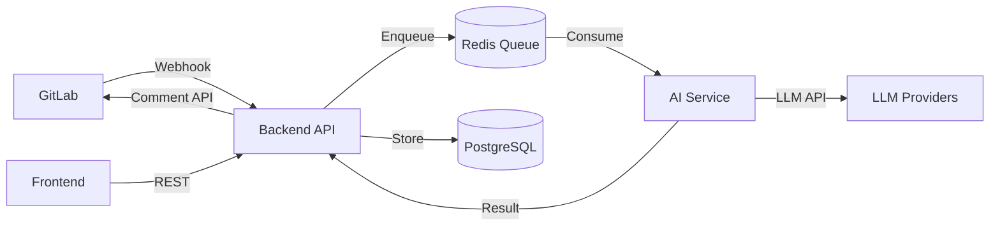

# Technical Architecture - MoonLens GitLab AI 代码审查平台

## 技术栈选择理由

### 后端: NestJS + TypeScript
**选择理由**:
- **企业级框架**: 提供完整的架构模式（模块化、依赖注入、装饰器）
- **TypeScript 原生**: 类型安全，减少运行时错误，提升开发效率
- **微服务就绪**: 内置微服务支持，便于未来拆分和扩展
- **生态完善**: 丰富的插件和中间件，加速开发
- **GitLab 集成友好**: 优秀的 HTTP 客户端和 Webhook 处理能力

**关键依赖**:
- `@nestjs/platform-express`: Web 框架
- `@nestjs/typeorm`: 数据库 ORM
- `@nestjs/bull`: 队列处理
- `@nestjs/config`: 配置管理
- `@nestjs/jwt`: 认证授权

### AI 服务: Python FastAPI
**选择理由**:
- **AI 生态优势**: Python 是 AI/ML 的主流语言，库支持最全面
- **高性能异步**: FastAPI 基于 Starlette，性能接近 Go
- **自动文档**: 内置 OpenAPI 文档生成
- **类型提示**: 利用 Python 3.11+ 类型系统
- **LLM 集成便利**: 所有主流 LLM SDK 都优先支持 Python

**关键依赖**:
- `fastapi`: Web 框架
- `pydantic`: 数据验证
- `httpx`: 异步 HTTP 客户端
- `openai`: OpenAI SDK
- `anthropic`: Claude SDK
- `tenacity`: 重试机制

### 数据库: PostgreSQL
**选择理由**:
- **ACID 合规**: 保证数据一致性和可靠性
- **JSON 支持**: 灵活存储非结构化数据（如 AI 响应）
- **性能优秀**: 复杂查询性能出色，支持索引优化
- **扩展性强**: 支持分区、复制、分片
- **GitLab 兼容**: GitLab 本身使用 PostgreSQL

### 队列: Redis + BullMQ
**选择理由**:
- **低延迟**: 内存存储，毫秒级响应
- **简单可靠**: 成熟稳定，运维简单
- **BullMQ 集成**: Node.js 生态最佳队列方案
- **可视化工具**: Bull Board 提供队列监控
- **升级路径**: 可平滑迁移到 RabbitMQ

### 前端: Vue 3 + Vite
**选择理由**:
- **渐进式框架**: 易学易用，适合快速开发
- **Composition API**: 更好的逻辑复用和类型推导
- **Vite 构建**: 极速热更新，优秀的开发体验
- **生态丰富**: Element Plus、Pinia 等成熟方案
- **GitLab UI 风格**: 易于模仿 GitLab 设计语言

## 系统架构设计

### 分层架构
```
┌─────────────────────────────────────────────┐
│            Presentation Layer                │
│         (Vue Frontend + REST API)            │
├─────────────────────────────────────────────┤
│            Application Layer                 │
│     (NestJS Controllers + Services)         │
├─────────────────────────────────────────────┤
│             Domain Layer                    │
│    (Business Logic + Domain Models)         │
├─────────────────────────────────────────────┤
│          Infrastructure Layer               │
│  (Database + Queue + External APIs)         │
└─────────────────────────────────────────────┘
```

### 微服务架构演进路径

#### 当前: 模块化单体
```
Backend (NestJS)
├── GitLabModule
├── ReviewModule
├── ProjectModule
├── AuthModule
└── QueueModule

AI Service (FastAPI)
├── review_engine
├── llm_providers
└── prompt_templates
```

#### 未来: 微服务拆分
```
API Gateway
├── gitlab-service
├── review-service
├── ai-service
├── project-service
└── notification-service
```

### 数据流架构



## 关键技术决策

### 1. 异步处理模式
**决策**: 事件驱动 + 消息队列
```typescript
// 事件流程
GitLab Webhook → NestJS Handler → BullMQ Job → AI Service → Callback → GitLab API
```
**理由**:
- 解耦服务，提高可用性
- 支持重试和错误恢复
- 可横向扩展处理能力
- 不阻塞 GitLab MR 流程

### 2. LLM Provider 抽象
**决策**: 策略模式 + 适配器模式
```python
class LLMProvider(ABC):
    @abstractmethod
    async def review(self, context: ReviewContext) -> ReviewResult:
        pass

class OpenAIProvider(LLMProvider):
    async def review(self, context: ReviewContext) -> ReviewResult:
        # OpenAI 实现
        
class AnthropicProvider(LLMProvider):
    async def review(self, context: ReviewContext) -> ReviewResult:
        # Anthropic 实现
```
**理由**:
- 供应商无关性
- 便于切换和 A/B 测试
- 支持 fallback 机制
- 适应不同模型特性

### 3. 安全架构
**决策**: 零信任 + 最小权限
- **Webhook 验证**: HMAC 签名校验
- **Token 加密**: AES-256-GCM 加密存储
- **API 认证**: JWT + Refresh Token
- **数据隔离**: 租户级数据隔离
- **审计日志**: 所有操作可追溯

### 4. 缓存策略
**决策**: 多级缓存
```
L1: 应用内存缓存 (LRU)
L2: Redis 缓存
L3: PostgreSQL 
```
**缓存内容**:
- GitLab 项目元数据 (TTL: 1h)
- LLM 响应 (TTL: 7d, 用于去重)
- 用户会话 (TTL: 24h)

### 5. 配置管理
**决策**: 环境变量 + 配置中心
```typescript
// 配置优先级
1. 环境变量 (最高)
2. .env 文件
3. 配置中心 (Consul/etcd)
4. 默认值 (最低)
```

## 性能优化策略

### 1. 数据库优化
- **索引策略**: 基于查询模式的复合索引
- **分区表**: 按月分区审查记录
- **连接池**: 动态调整连接数
- **查询优化**: EXPLAIN 分析，避免 N+1

### 2. API 性能
- **响应压缩**: Gzip/Brotli
- **分页加载**: Cursor-based pagination
- **字段过滤**: GraphQL-like field selection
- **并发控制**: Rate limiting + Circuit breaker

### 3. AI 处理优化
- **批处理**: 合并小任务
- **流式响应**: Server-Sent Events
- **Token 优化**: 动态调整 max_tokens
- **模型选择**: 根据任务复杂度选择模型

## 可扩展性设计

### 水平扩展
```yaml
# Kubernetes HPA 配置
Backend Pods: 2-10 (基于 CPU/Memory)
AI Service Pods: 1-5 (基于队列长度)
Redis: Master-Slave 复制
PostgreSQL: 读写分离
```

### 垂直扩展
- **Backend**: 4 Core / 8GB RAM (推荐)
- **AI Service**: 2 Core / 4GB RAM
- **PostgreSQL**: 8 Core / 16GB RAM
- **Redis**: 2 Core / 4GB RAM

### 插件化架构
```typescript
// 插件接口
interface IReviewPlugin {
  name: string;
  version: string;
  execute(context: PluginContext): Promise<PluginResult>;
}

// 插件示例
class SecurityPlugin implements IReviewPlugin {
  async execute(context: PluginContext): Promise<PluginResult> {
    // SAST 扫描逻辑
  }
}
```

## 监控与可观测性

### 指标收集
- **Prometheus**: 系统和业务指标
- **Grafana**: 可视化仪表板
- **Jaeger**: 分布式追踪
- **ELK Stack**: 日志聚合分析

### 关键指标
```typescript
// 业务指标
- review_requests_total
- review_duration_seconds
- review_errors_total
- llm_tokens_used_total

// 系统指标
- http_request_duration_seconds
- database_query_duration_seconds
- queue_job_duration_seconds
- memory_usage_bytes
```

### 告警规则
- **P1**: API 响应时间 > 5s
- **P1**: 错误率 > 5%
- **P2**: 队列积压 > 100
- **P2**: 数据库连接池耗尽
- **P3**: Token 使用量异常

## 技术债务管理

### 当前技术债务
1. **单体数据库**: 所有数据在一个 PostgreSQL 实例
2. **同步 GitLab API**: 部分调用仍是同步的
3. **简单重试**: 缺少智能退避算法
4. **基础监控**: 缺少业务级监控

### 偿还计划
- **Q2 2025**: 数据库读写分离
- **Q3 2025**: 全异步化 GitLab 交互
- **Q3 2025**: 实现指数退避 + 抖动
- **Q4 2025**: 完整的 APM 解决方案

## 灾难恢复

### 备份策略
- **数据库**: 每日全量 + 每小时增量
- **配置**: Git 版本控制
- **密钥**: 加密备份到独立存储

### 故障转移
- **主备切换**: PostgreSQL 流复制
- **服务降级**: 关闭非核心功能
- **限流**: 优先保证付费用户

### RTO/RPO 目标
- **RTO**: < 1 小时
- **RPO**: < 15 分钟

## 合规与标准

### 遵循标准
- **API 设计**: RESTful + OpenAPI 3.0
- **代码规范**: ESLint + Prettier + Black
- **Git 流程**: GitFlow + Conventional Commits
- **文档**: JSDoc + Sphinx

### 安全合规
- **OWASP Top 10**: 安全编码实践
- **GDPR**: 数据隐私保护
- **SOC 2**: 未来认证目标

## 技术路线图

### 2025 Q1-Q2
- ✅ 核心 MVP 功能
- ✅ 多 LLM 支持
- 📋 性能优化
- 📋 基础监控

### 2025 Q3-Q4
- 🔮 RAG 集成
- 🔮 微服务拆分
- 🔮 高级监控
- 🔮 自动扩缩容

### 2026
- 🏢 私有化部署
- 🏢 模型微调平台
- 🏢 多云支持
- 🏢 边缘计算

---

*本文档定义了 MoonLens 的技术架构决策和演进路径，确保系统的可扩展性、可维护性和高性能。*